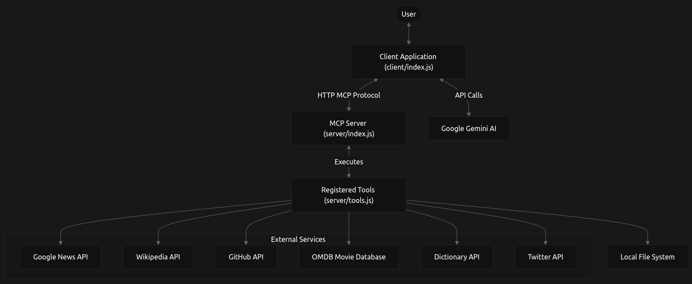
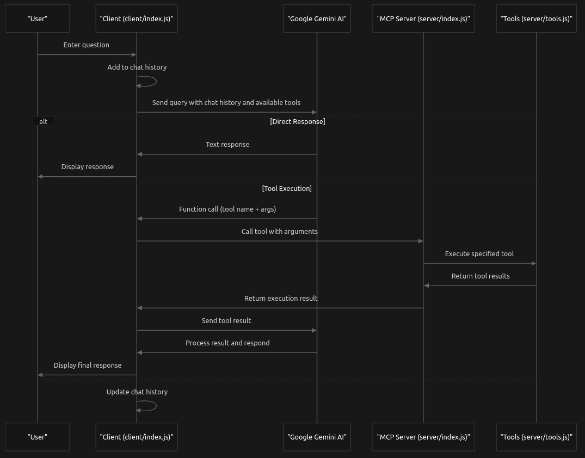

# MCPlex-AI v1.0

This document provides an introduction to MCPlex-AI v1.0, a system that integrates Google's Gemini large language model with external tools through a Model Context Protocol (MCP). Unlike typical chatbot frontends, MCPlex-AI runs entirely from the command line, giving users fine-grained control and a minimalistic interface to execute intelligent queries and trigger tool-based actions — all from a single terminal. The document covers the system's purpose, high-level architecture, key components, and interaction patterns. For detailed information about specific components, please refer to their respective sections:

## Purpose

MCPlex-AI v1.0 is designed to enhance the capabilities of large language models (Google Gemini-2.0) by enabling them to interact with external tools and APIs. This allows the AI to:

1) Access real-time information (news, Wikipedia, etc.)
2) Perform specific actions (post to Twitter, search files)
3) Calculate results (truth tables, mathematical operations)
4) Retrieve data from external services (GitHub, OMDB)

## System Architecture

The system follows a client-server architecture where the client handles user interaction and AI communication, while the server manages tool execution. MCPlex-AI consists of three primary components:

* **MCP Client (client/index.js)**: Handles user chat with Google Gemini AI, sends tool execution requests to the server
* **MCP Server (server/index.js)**: Manages tool registration and execution, handles client requests
* **Tool System (server/tools.js)**: Collection of tools that extend the AI's capabilities

The diagram below illustrates the high-level architecture of the system:



## Available Tools

| Tool Name | Description | Source Location |
|-----------|-------------|-----------------|
| print-menu | Prints available tools | [server/tools.js (37-71)](server/tools.js) |
| news-by-topic | Fetches news headlines | [server/tools.js (74-128)](server/tools.js) |
| twitter-X-post | Posts to Twitter/X | [server/tools.js (156-177)](server/tools.js) |
| wikipedia-search | Searches Wikipedia | [server/tools.js (180-225)](server/tools.js) |
| github-repo-info | Gets GitHub repo info | [server/tools.js (228-268)](server/tools.js) |
| movie-ratings | Gets movie information | [server/tools.js (271-354)](server/tools.js) |
| local-file-search | Searches local files | [server/tools.js (356-522)](server/tools.js) |
| truth_table | Generates truth tables | [server/tools.js (525-588)](server/tools.js) |
| define_word | Gets word definitions | [server/tools.js (590-618)](server/tools.js) |

## Usage

### 1. Print Menu Tool

**Name**: print-menu
**Description**: Prints what the MCP server can do with the available tools, provides descriptions of tools.

**Input Parameters**:
- title (string, optional): Optional title for the menu
- items (array of strings): List of tool descriptions to display
- **Output**: Formatted text displaying the menu items with numbering.

### 2. News by Topic Tool

**Name**: news-by-topic
**Description**: Fetches recent news headlines for a given topic using Google News.

**Input Parameters**:
- topic (string): The topic to search news for (e.g., AI, economy, cricket)
- **Output**: Formatted text containing up to 5 recent news headlines with links.

**Example Response**:

```
Top News for "AI":

[1] Microsoft announces new AI features for Windows 11 Read more
[2] OpenAI unveils GPT-5 with improved reasoning capabilities Read more
[3] AI regulation bill passes in EU parliament Read more
[4] AI startup funding reaches record high in Q2 2023 Read more
[5] New research shows AI models becoming more energy efficient Read more
```

### 3. Adder Tool (First tool for basic testing)

**Name**: adder
**Description**: Adds two numbers together.

**Input Parameters**:
- a (number): The first number
- b (number): The second number
- **Output**: Text containing the sum of the two numbers.

### 4. Twitter/X Post Tool

**Name**: twitter-X-post
**Description**: Creates and posts a tweet on X (formerly Twitter).

**Input Parameters**:
- status (string): The content of the tweet
- **Output**: Confirmation text with the posted tweet ID.
- **Note**: Requires Twitter API configuration in server environment.

### 5. Wikipedia Search Tool

**Name**: wikipedia-search
**Description**: Searches Wikipedia and returns the summary of the top result.

**Input Parameters**:
- query (string): The search term for Wikipedia
- **Output**: Title, summary extract, and link to the Wikipedia article.

**Example Response**:
```
Artificial Intelligence

Artificial intelligence (AI) is intelligence demonstrated by machines, as opposed to the natural intelligence displayed by animals including humans. AI research has been defined as the field of study of intelligent agents, which refers to any system that perceives its environment and takes actions that maximize its chance of achieving its goals.

Read more on Wikipedia
```

### 6. GitHub Repo Info Tool

**Name**: github-repo-info
**Description**: Fetches information about a public GitHub repository.

**Input Parameters**:
- owner (string): GitHub username or organization
- repo (string): Repository name
- **Output**: Formatted text containing repository details, including stars, forks, and open issues.

**Example Response**:
```
📦 Repository Name: octocat/Hello-World

📝 Description: My first repository on GitHub!
⭐ Stars: 1337
🍴 Forks: 1234
🚩 Open Issues: 42
🔗 Repository Link: https://github.com/octocat/Hello-World
```

### 7. Movie Ratings Tool

**Name**: movie-ratings
**Description**: Gets ratings and information for movies or TV shows from various sources.

**Input Parameters**:
- title (string): The title of the movie or TV show to search for
- year (number, optional): Release year to narrow down search results
- plot (enum: 'short' or 'full', default: 'short', optional): Length of plot summary
- **Output**: Comprehensive formatted information about the movie/show, including ratings from different sources, plot summary, and additional details.

**Example Response**:
```
🎬 The Matrix (1999)

Genre: Action, Sci-Fi
Director: Lana Wachowski, Lilly Wachowski
Starring: Keanu Reeves, Laurence Fishburne, Carrie-Anne Moss
Runtime: 136 min

⭐ RATINGS

IMDB: 8.7/10 ⭐⭐⭐⭐⭐⭐⭐⭐⭐ (1,780,994 votes)
Rotten Tomatoes: 88%
Metacritic: 73/100

PLOT: A computer hacker learns from mysterious rebels about the true nature of his reality and his role in the war against its controllers.

ADDITIONAL INFO

Rated: R
Released: 31 Mar 1999
Awards: Won 4 Oscars. 42 wins & 51 nominations total
Box Office: $171,479,930

View on IMDB
```

**Note**: Requires OMDB API key configuration in server environment.

### 8. Local File Search Tool

**Name**: local-file-search

**Description**: Finds files on the local system based on name, extension, or content.

**Input Parameters**:
- searchTerm (string): Term to search for in filenames or content
- directory (string, default: './'): Directory to search in
- fileType (enum: 'all', 'name', 'extension', 'content', default: 'all'): Type of search
- **Output**: Formatted text containing search results with file details including name, size, and last modified date.

**Example Response**:
```
File Search Results

Search term: "config"
Directory: ./src
Search type: all
Files scanned: 156
Matches found: 7

Filename                Size        Last Modified
────────────────────────────────────────────────────────────
 1) config.json         12.4 KB     2023-03-15 14:22:18
 2) app.config.js        8.7 KB     2023-03-14 10:15:46
 3) webpack.config.js   15.3 KB     2023-03-10 09:38:21
 4) test-config.json     2.1 KB     2023-03-09 16:45:32
 5) .env.config          1.2 KB     2023-03-08 11:23:57
 6) config-utils.js      5.9 KB     2023-03-05 19:12:08
 7) server-config.js     7.8 KB     2023-03-01 14:30:42
```

### 9. Truth Table Generator Tool

**Name**: truth_table
**Description**: Generates the truth table of a boolean expression.

**Input Parameters**:
- expression (string): Boolean expression using variables like A, B, C and operators like &&, ||, !
- **Output**: Formatted truth table showing all possible combinations of variable values and the resulting expression evaluation.

**Example Response**:
```
Truth Table:
A | B | C | Result
--------------------
F   F   F |   F
F   F   T |   T
F   T   F |   F
F   T   T |   T
T   F   F |   F
T   F   T |   T
T   T   F |   T
T   T   T |   T
```

**Sources**: server/tools.js (525-588)

### 10. Define Word Tool

**Name**: define_word
**Description**: Gets the definition and example usage of a word.

**Input Parameters**:
- word (string): Word to define
- **Output**: Definition and example usage of the specified word.

**Example Response**:
```
📖 Definition of serendipity: The occurrence and development of events by chance in a happy or beneficial way.
💡 Example: A fortunate stroke of serendipity came his way when he met his future wife on a flight.
```

## **Model Context Protocol (MCP)**

The Model Context Protocol (MCP) is a standardized communication protocol that enables the MCPlex-AI system to connect large language models (LLMs) with external tools. This protocol serves as the foundation for interactions between the client application and the server component, allowing the Google Gemini AI model to discover, request, and utilize various tools to enhance its capabilities.

### **Communication Flow**

The Model Context Protocol follows a request-response pattern but extends it with session management and streaming capabilities. The flow typically begins with session initialization, followed by tool discovery, and then tool invocation as needed by the AI.



## **Setup and Installation Guide**

This section provides step-by-step instructions for setting up and installing the MCPlex-AI v1.0 system. It covers repository setup, configuring the client and server components, setting up necessary API keys, and running the system.

### **Prerequisites**

Ensure the following are installed and available before installation:

- **Node.js** (v16 or higher)
- **npm** (v7 or higher)
- Access to the following external APIs:
    - Google Gemini API
    - Twitter/X API
    - OMDB API

#### **Required API Keys**

| API             | Purpose                     |
|----------------|-----------------------------|
| Google Gemini  | Connect to Gemini AI        |
| Twitter API    | Post tweets via AI agent    |
| OMDB API       | Fetch movie/TV ratings      |

### **Repository Setup**

```bash
git clone https://github.com/Ecolash/MCPlex-AI-v1.0.git
cd MCPlex-AI-v1.0
```

#### **Structure**

```
MCPlex-AI-v1.0/
│
├── client/            # Client app, Gemini connection
│   ├── .env.example
│   ├── index.js
│   └── package.json
│
├── server/            # MCP server and tools
│   ├── .env.example
│   ├── server.js
│   ├── tools/
│   └── package.json
│
├── .gitignore
└── README.md
```

### **Server Setup**

The **server** hosts the MCP controller and tool modules.

```bash
cd server
npm install
```

#### **Server Environment Configuration**

1. Copy `.env.example` to `.env`
2. Add the required API credentials

**Environment Variables Required:**

| Variable               | Description                 | Used By              |
|------------------------|-----------------------------|----------------------|
| `TWITTER_API_KEY`      | Twitter API key             | Twitter Tool         |
| `TWITTER_API_SECRET`   | Twitter API secret          | Twitter Tool         |
| `TWITTER_ACCESS_TOKEN` | Twitter access token        | Twitter Tool         |
| `TWITTER_ACCESS_SECRET`| Twitter access secret       | Twitter Tool         |
| `OMDB_API_KEY`         | OMDB API Key                | Movie Ratings Tool   |

### **Client Setup**

The **client** interfaces with the Gemini model and connects to the MCP server.

```bash
cd client
npm install
```

#### **Client Environment Configuration**

1. Copy `.env.example` to `.env`
2. Add the `GEMINI_API_KEY`

**Environment Variable Required:**

| Variable         | Description                    |
|------------------|--------------------------------|
| `GEMINI_API_KEY` | Google Gemini API integration  |

### **Running the System**

Start both components in separate terminals:

#### **Start the Server**

```bash
cd server
node index.js
# or
npx nodemon index.js
```

The server should print a message confirming it's running.

#### **Start the Client**

```bash
cd client
node index.js
```

##### Troubleshooting

| Issue                          | Cause                                | Solution                                 |
|--------------------------------|---------------------------------------|------------------------------------------|
| API key not found              | Missing `.env` or wrong key           | Check `.env` files and key values        |
| Connection refused             | Server not running                    | Start server before client               |
| Tool execution failure         | Incomplete API credentials            | Ensure all APIs are configured           |
| Authentication failure         | Expired/invalid API tokens            | Regenerate and update keys               |

##### Security Notes

- API keys are stored in `.env` files (excluded via `.gitignore`)
- Never commit your `.env` files to version control
- Rotate keys regularly per provider best practices
- Use firewalls or IP restrictions if deploying publicly
